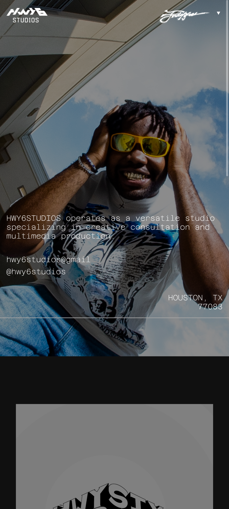
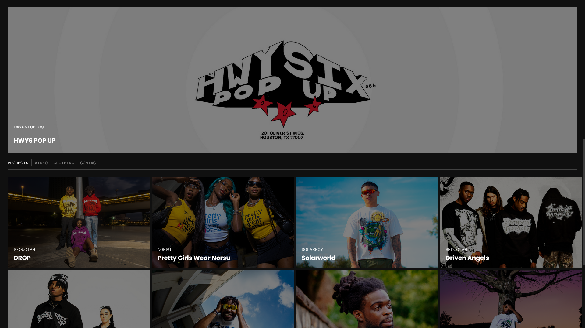

# HWY6-STUDIOS

  
## Description
  
An HTML, CSS, and JavaScript powered website made for the HWY6-STUDIOS Creative Team.
  
## Table of Contents
  
- [Installation](#installation)
- [Usage](#usage)
- [License](#license)
- [Contributing](#contributing)
- [Media](#media)
- [Credits](#credits)
  
## Installation
  
N/A

## Technologies

- HTML
- CSS
- JavaScript

  
## Usage

## License
  
This project is covered under the MIT license.
  
## Contributing
  
N/A
  
## Media

Click to watch the full video on YouTube!

  
  
  

## Credits

  Ediubong Ekwere | JunoAndIce

  <https://github.com/JunoAndIce> | [ekwere.edi@gmail.com](mailto:ekwere.edi@gmail.com)
  
